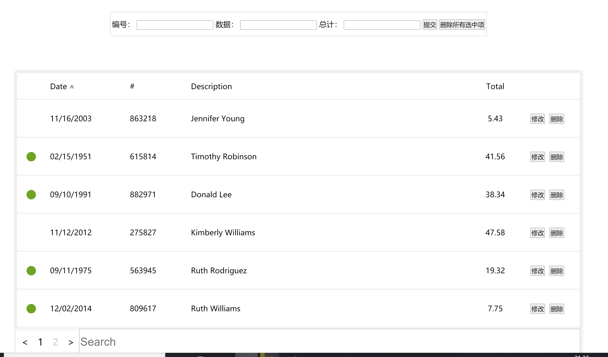

# VUE_TEST1

前端 vue 任务一

使用原生 VUE

------

12.16完成任务：



有添加，修改，删除功能，点击选项前面的小圆点选中，选中后可以一键删除

数据用mockjs生成假数据

search使用了计算属性

当页显示也是用了计算属性

总体结构有点混乱

但是是全部由原生vue完成

挺综合的一个任务


------

突然理解不过来 sort 函数了

cmp 函数：
如果要得到自己想要的结果，不管是升序还是降序，就需要提供比较函数了。该函数比较两个值的大小，然后返回一个用于说明这两个值的相对顺序的数字。

比较函数应该具有两个参数 a 和 b，其返回值如下：

若 a 小于 b，即 a - b 小于零，则返回一个小于零的值，数组将按照升序排列。

若 a 等于 b，则返回 0。

若 a 大于 b, 即 a - b 大于零，则返回一个大于零的值，数组将按照降序排列

---

搜索功能：
本来是利用 showlist 计算属性 从 list 中计算出该页面显示的数据
但是添加搜索功能则利用 showlist 计算属性从 searchlist 中计算出该页面显示的数据
而 searchlist 也是一个计算属性 从 list 中计算出需要显示的数据

改进后使用filter过滤器

```
slist = this.list.filter(function (x) {
    if (x.no.search(that.searchdate) != -1 || x.data
        .search(that
            .searchdate) != -1) {
        return true;
    } else {
        return false;
    }
})
return slist;


```

总结一下   showlist是该页面显示的数据 根据nowpage和searchlist计算出   

searchlist是 应该显示的总数据  应该显示  应该显示     由list计算出

list是总数据   固定不变的 

后续添加增加功能也是应该添加再list里面

 list更改= searchlist更改= showlist更改

------

删除功能本来打算用some方法，可是不太熟悉

或者不能用some  some返回到一个之后就停止了

还是用filter更好：

```
del: function (el) {
    // console.log(el);
    let that = this;
    this.list = this.list.filter(itm => {
        // console.log(el);
        // console.log(itm.key);
        // itm.key === el ? false : true
        if (itm.key === el) {
            return false;
        } else {
            return true
        }
    })
}
```

------

数据生成：

利用mockjs生成假数据：

```
# 安装
npm install mockjs

```

使用

```

// 使用 Mock
var Mock = require('mockjs')
var data = Mock.mock({
    // 属性 list 的值是一个数组，其中含有 1 到 10 个元素
    'list|1-10': [{
        // 属性 id 是一个自增数，起始值为 1，每次增 1
        'id|+1': 1
    }]
})
// 输出结果
console.log(JSON.stringify(data, null, 4))
```

本次实现代码：

```
// 使用 Mock
var Mock = require('mockjs');
var a = 0;
const { name } = require('_commander@6.2.1@commander');
var time = function () {
    let time = new Date();
    // console.log(`${time.getMonth() + 1}/${time.getDate()}/${time.getFullYear()}`);
    return `${time.getMonth() + 1}/${time.getDate()}/${time.getFullYear()}`
}
var now = function () {
    a++;
    return a.toString();
}
var data = Mock.mock({
    // 属性 list 的值是一个数组，其中含有 1 到 10 个元素
    'list|1-20': [{
        // 属性 id 是一个自增数，起始值为 1，每次增 1
        'key|+1': 1,
        'show|1': true,
        'date': Mock.mock('@date("yyyy-MM-dd")'),
        "no": /[0-9]{6}/,
        //利用正则表达式

        'data': '@name',
        'total|0-100.2': 1
    }]
})
// 输出结果
console.log(JSON.stringify(data, null, 4))// 使用 Mock
var Mock = require('mockjs');
const { name } = require('_commander@6.2.1@commander');
var time = function () {
    let time = new Date();
    // console.log(`${time.getMonth() + 1}/${time.getDate()}/${time.getFullYear()}`);
    return `${time.getMonth() + 1}/${time.getDate()}/${time.getFullYear()}`
}
var data = Mock.mock({
    // 属性 list 的值是一个数组，其中含有 1 到 10 个元素
    'list|1-10': [{
        // 属性 id 是一个自增数，起始值为 1，每次增 1
        'key|+1': 1,
        'show|1': true,
        'date': time(),
        'no|000000-999999': 1,
        'data': '@name',
        'total|0-100.2': 1
    }]
})
// 输出结果
console.log(JSON.stringify(data, null, 4))
```

输出：

```
{
    "list": [
        {
            "key": 1,
            "show": false,
            "date": "1988-09-26",
            "no": "569720",
            "data": "Sandra Gonzalez",
            "total": 36.03
        },
        {
            "key": 2,
            "show": true,
            "date": "1988-09-26",
            "no": "847015",
            "data": "Jessica Thomas",
            "total": 65.22
        },
        {
            "key": 3,
            "show": true,
            "date": "1988-09-26",
            "no": "831313",
            "data": "Carol Jackson",
            "total": 56.47
        },
        {
            "key": 4,
            "show": false,
            "date": "1988-09-26",
            "no": "572305",
            "data": "Michelle Martinez",
            "total": 2.28
        },
        {
            "key": 5,
            "show": false,
            "date": "1988-09-26",
            "no": "429642",
            "data": "Brenda Davis",
            "total": 63.67
        },
        {
            "key": 6,
            "show": false,
            "date": "1988-09-26",
            "no": "848757",
            "data": "Shirley Moore",
            "total": 69.25
        },
        {
            "key": 7,
            "show": false,
            "date": "1988-09-26",
            "no": "334636",
            "data": "Jessica Jackson",
            "total": 34.62
        }
    ]
}{
    "list": [
        {
            "key": 1,
            "show": true,
            "date": "12/16/2020",
            "no": 543201,
            "data": "George Rodriguez",
            "total": 63.22
        },
        {
            "key": 2,
            "show": true,
            "date": "12/16/2020",
            "no": 601113,
            "data": "Barbara Brown",
            "total": 39.47
        },
        {
            "key": 3,
            "show": false,
            "date": "12/16/2020",
            "no": 722861,
            "data": "William Moore",
            "total": 11.35
        },
        {
            "key": 4,
            "show": true,
            "date": "12/16/2020",
            "no": 971399,
            "data": "Anthony Walker",
            "total": 56.18
        },
        {
            "key": 5,
            "show": false,
            "date": "12/16/2020",
            "no": 673948,
            "data": "Elizabeth White",
            "total": 41.56
        },
        {
            "key": 6,
            "show": true,
            "date": "12/16/2020",
            "no": 986220,
            "data": "Jennifer White",
            "total": 93.35
        },
        {
            "key": 7,
            "show": true,
            "date": "12/16/2020",
            "no": 883398,
            "data": "John Anderson",
            "total": 3.18
        },
        {
            "key": 8,
            "show": true,
            "date": "12/16/2020",
            "no": 108338,
            "data": "Cynthia Rodriguez",
            "total": 48.69
        }
    ]
}
```

------

   关于属性名加引号和不加引号的区别

这个问题很好有人关注，但我每一次在声明一个对象属性的时候都要想想要不要给属性加引号？加引号与不加引号有什么区别？

其实在JavaScript中，加引号与不加引号都是一样用，都是有效的。

如：

```javascript
var obj = {
    name    : '琼台博客',
    'age'   : 18,
};
document.write( 'name : ' + obj['name'] + '<br />' );
document.write( 'age : ' + obj.age + '<br />' );
```

执行：

name : 琼台博客
age : 18

哪在什么时候有区别呢？在你使用一些非合法命名规则的时候，就显的有必要了

比如：

```javascript
var obj = {
    888name : '琼台博客'
};
document.write( '888name : ' + obj.888name + '<br />' );
```

这时候会报错误

如果加上引号，使用 “.属性名”: 方式读取属性时仍然会出错：


```javascript
var obj = {
    '888name' : '琼台博客'
};
document.write( '888name : ' + obj.888name + '<br />' );
```

如果加上引号，使用 “[‘属性名']”: 方式读取属性时不会出错：

```javascript
var obj = {
    '888name': '琼台博客'
};
document.write('888name : ' + obj['888name'] +'<br />' );
```

执行：

888name : 琼台博客

甚至还可以更特殊一点，如：

```javascript
var obj = {
    '': '这个属性名是空的',
    ' ': '这个属性名是一个空格'
};
document.write(  obj[''] +'<br />' );
document.write(  obj[' '] +'<br />' );
```

执行：

这个属性名是空的
这个属性名是一个空格

我们引用对象成员的时候，由于属性名不是合法命名规则，因此也需要使用中括号的方式来访问，也建议大家以后采取中括号的方式读取对象属性值，以免有意外错误

虽然实际我们写程序一般都遵守程序公约，不会去制造一些另类，但特殊性情况下，这些能力也可以弥补一些变态需求。


------

12.16晚已完成大部分

差一个批量删除

